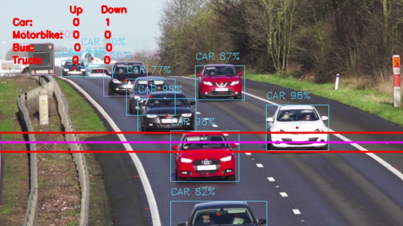

# Traffic Control System

This project was created as part of VCET Hackathon 2021 Reloaded. 

It proposes a system for efficient management and monitoring of traffic by collecting data through videos and provide improved signaling system by analysing this data.

## Vehicle Detection


- Video captured by cameras installed near signals at intersections using YOLOv3 object detection algorithm. 
- 3 lines marked on the on the output video are used to differentiate between incoming and outgoing cars and count them.

- The data displayed is stored in ```data.csv``` for further use and analysis.


This image indicates detection for bidirectional lanes.

## Signaling Algorithm

- Deployed an algorithm for management of signals at an intersection according to the traffic at each lane.
- Alloting green time based on the amount of traffic on the lane and amount of waiting time.

- ### Simulation


- The black lines indicate the road with the back circle as the intersection.
- The colored circles indicate the color of the signals and the number inside them indicate the number of vehicles on the corresponding lane.
- The counter in the white indicates the timer for the green signal.

## Authors

- [Pushkar Save](https://github.com/Shade1912)
- [Mihir Thakur](https://github.com/Mik-27)
- [Anand Tiwari](https://github.com/AnandTiwari1108)
- [Manav Kesarkar](https://github.com/Manav3010)